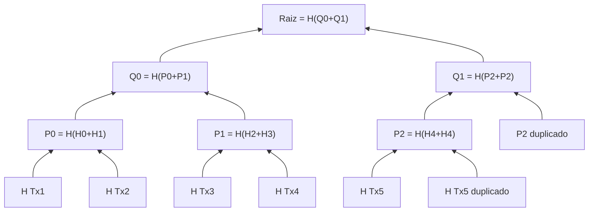

# Laboratorio 2 - Árbol de Merkle
**Estudiante:** Arelis Giraldo

## De qué se trata
El ejercicio consiste en implementar un árbol de Merkle: una estructura que permite resumir un conjunto de transacciones en un único hash (la raíz), de forma que sea posible:

1. Detectar si alguna transacción fue alterada, sin tener que comparar todas una por una.
2. Generar, para una transacción puntual, una prueba corta ("prueba de inclusión") que demuestra que pertenece al conjunto, sin necesitar todas las demás transacciones para verificarla.

## Qué hay en este repositorio

* **merkle_tree.py**: contiene la implementación del árbol. Incluye `hash_hoja()` (hash de una transacción), `hash_padre()` (combina dos hashes hijos), la clase `MerkleTree` (construye el árbol, genera la prueba de inclusión de una transacción y una representación en texto del árbol) y `verificar_prueba()` (verifica una prueba de inclusión sin necesitar el árbol completo).
* **prueba.py**: usa `merkle_tree.py` con un conjunto de transacciones de ejemplo. Construye el árbol, muestra la raíz, demuestra que modificar una transacción cambia la raíz, genera la prueba de inclusión de una transacción específica y la verifica tanto con el dato verdadero como con un dato alterado.

## Cómo correrlo
Solo se necesita Python (no requiere librerías externas, `hashlib` viene incluida). Los dos archivos deben estar en la misma carpeta.

```
python prueba.py
```

Esto muestra en consola: las transacciones de ejemplo, el árbol completo, la raíz, la comparación entre la raíz original y una raíz modificada, la prueba de inclusión de una transacción y el resultado de verificarla con un dato correcto y con uno falso.

## Estructura del árbol (ejemplo)

Así queda el árbol con las 5 transacciones de ejemplo de `prueba.py`. Como 5 es impar, `Tx5` se duplica en el primer nivel, y luego el nodo resultante también se duplica un nivel más arriba:




## Cómo se resolvió cada problema

**Resumir muchas transacciones en un solo hash:** cada transacción se hashea individualmente (hoja) y los hashes se van combinando de dos en dos, nivel por nivel, hasta quedar en un único hash (la raíz). Cualquier cambio en una sola transacción cambia el hash de esa hoja y, en cascada, la raíz final.

**Número impar de transacciones:** si un nivel queda con una cantidad impar de hashes, se duplica el último para poder seguir combinando de dos en dos, sin inventar una transacción nueva.

**Verificar una transacción sin el árbol completo:** al construir el árbol se guardan también los niveles intermedios, no solo la raíz. Con eso, `prueba_de_inclusion()` devuelve solo los hashes "hermanos" necesarios para esa transacción puntual (no todo el árbol).

**Cómo compruebo que la prueba es válida:** `verificar_prueba()` parte del hash de la transacción y lo va combinando con cada hermano de la prueba, respetando si va a la izquierda o a la derecha, hasta llegar a un hash final. Si ese hash coincide con la raíz esperada, la transacción sí pertenece al árbol; si el dato fue alterado, el resultado final no coincide. Esto queda demostrado en `prueba.py`, primero con el dato verdadero (coincide) y luego con un dato falso usando la misma prueba y la misma raíz (no coincide).

## Uso de Inteligencia Artificial

Durante el desarrollo de este laboratorio utilizamos Inteligencia Artificial como una herramienta de apoyo tanto para el aprendizaje como para la programación. La utilizamos para comprender los conceptos relacionados con los Árboles de Merkle, resolver dudas sobre la lógica del ejercicio y recibir orientación sobre cómo abordar la implementación.

La IA también nos proporcionó ejemplos y fragmentos de código que utilizamos como punto de partida. A partir de estos, revisamos qué hacía cada función, realizamos modificaciones y adaptamos el código a los requerimientos del laboratorio. Además, agregamos y ajustamos comentarios para entender mejor el funcionamiento de las diferentes partes de la implementación.

Durante el proceso ejecutamos el programa varias veces para comprobar su funcionamiento y corregir errores. También realizamos las pruebas de verificación con una transacción verdadera y con una transacción modificada para comprobar que los resultados fueran los esperados.

Por esta razón, la IA hizo parte importante del proceso de desarrollo y nos proporcionó apoyo tanto conceptual como de programación, pero trabajamos de manera conjunta con la herramienta: hicimos preguntas, analizamos las respuestas, adaptamos el código, realizamos pruebas y verificamos que comprendiéramos lo que estábamos implementando.